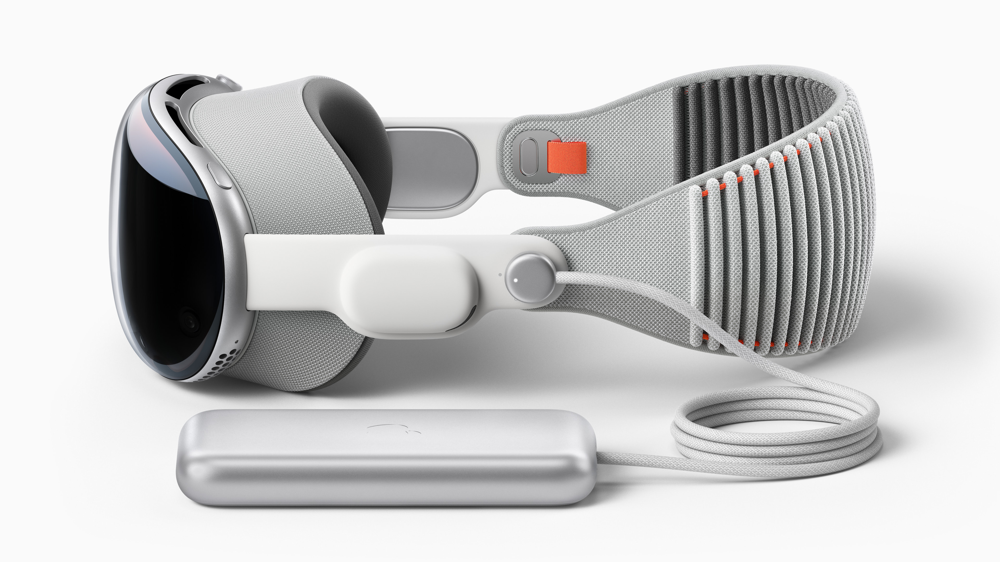
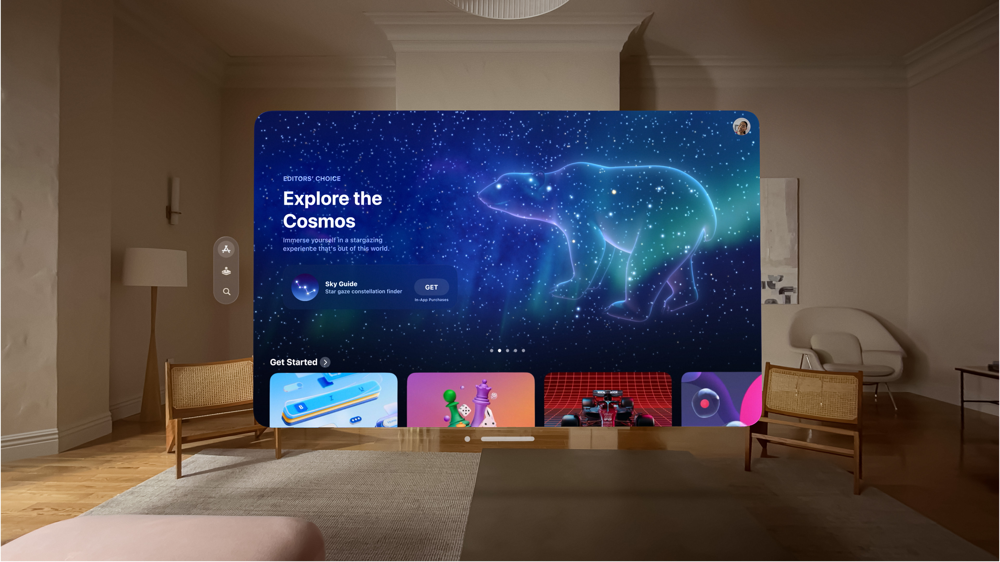
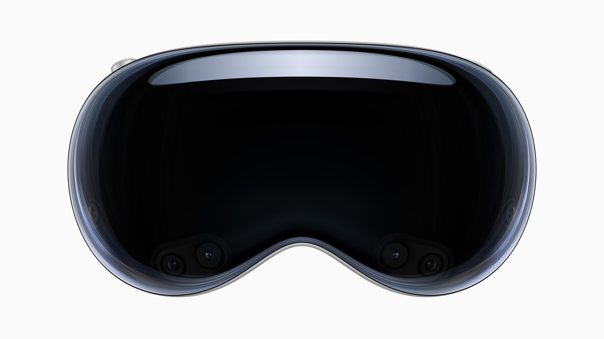

import imageBen from '@/images/team/Ben.png'

export const article = {
  date: '2023-06-18',
  title: 'First week at Foxor',
  description:
    "Apple unveiled it's visionPro headset today. They look incredible and beta users are saying they are so smart it feels like they are reading your mind.",
  author: {
    name: 'Benjamin Harden',
    role: 'Co-Founder',
    image: { src: imageBen },
  },
}

export const metadata = {
  title: article.title,
  description: article.description,
}

## 1. Catching the wave

With the unveiling of the new appl visionPro we see a huge market oppurtunity. This week is week one at Foxor and we already feel like there is just too much to do.
Our tech lead (titles will be assigned later) Kyle Rummens has already begun work on the infastructure for the 3D feeds from someones visionPro to be sent to another device.
We have put together a pricing model and are waiting for the paperwork to go through to setup the official LLC. Exciting times. 

<TopTip>
  We are looking to get on the wait list to be one of the first owners of a visionPro so we can use it for testing of the Foxor app.
</TopTip>

## 2. Early hurdles

This week on of the first minor hurtles we are working to sovle is which language we should use for our backend/api level code. After some diliberation on scalability fluency 
and price we have come to a conclusion. To start we are planning to build the backend in Node.js, and Deno, levergaing the power of serverless edge functions when appropriate while keeping a more traditional Node.js serverless
for when that is most appropriate. For the DB we have decided supabase is the best place to start. We also plan to build it open source from the begining to build confidence with investors and users. 

## 3. Keeping Momentum 

Our biggest fear today is losing momentum. 2024 can feel pretty far away sometimes and the goals we have for Foxor are certainly not small. Their is a common
mindset we often fall into where we make a lot of "motion" but don't take any real meaningful action. It is really just a complicated version of procrastination.
We want to stay aware of it and stay on task focusing on the most important things first. To help keep track of this we have built a ticket tracker for tasks in github.
Thanks for ready about our first week, and please forgive us if we still have lots of growth in front of us.

